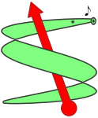
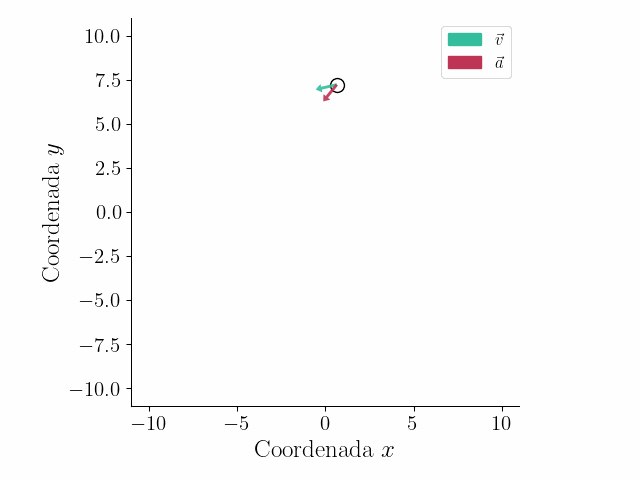

# diSimula

Simulador de trayectorias con vector velocidad y aceleración a partir de las 
coordenadas en función del tiempo $x(t)$ e $y(t)$.

## Uso

Dentro del archivo `trajectories.py` crea los $x(t)$ e $y(t)$ de la trayectoria que se quiere simular mediante una funcion de python. Se pueden poner curvas paramétricas y ecuaciones horarias. Es posible pasar parámetros físicos adicionales. Los parámetros físicos y se insertan en `params.yml`.

Hay algunos ejemplos de trayectorias cargados, sus animaciones están en `output` dentro del repo. Los ejemplos subidos en el repo se pueden crear de la siguiente manera:

~~~
Crea un video a partir de una trayectoria definida
como función de Python y las condiciones iniciales.

Usage:
  disimula.py <trajectory> -o <filename>
  disimula.py (-h | --help)
  disimula.py --version

Options:
  -h --help     Muestra este mensaje.
  --version     Muetra la versoin.
  -o            Archivo de salida (.gif o .mp4)
~~~

## Agregar trayectorias

Para agregar trayectorias es necesario agregar todos los parámetros físicos, el paso temporal $dt$ y el tiempo que dura la simulación $t_{max}$. 

## Ejemplos

Para agregar una trayectoria creamos una función dentro de `trajectories.py`, con el vector de tiempo (asegurate de crearlo con `np.arange` o algo que cree valores equiespaciados). Con ese vector tiempo creas tus $x(t)$ e $y(t)$ para guardarlos en el vector `r_vector` como indica el ejemplo que sigue:

~~~ python
def MRU(x0, y0, v0, angle, dt, t_max):
    
    # Convert angle to radians
    theta = np.radians(angle)

    # Create time array
    t = np.arange(0, t_max, dt)

    # Calculate x and y positions
    x = x0 + v0 * np.cos(theta) * t
    y = y0 + v0 * np.sin(theta) * t
    r_vector = np.asarray((x, y)).T

    return r_vector
~~~

Podes usar funciones de [numpy](https://numpy.org/) como `np.cos`, `np.sin`, `np.tan`, etc.

Podés agregar los parámetros que quieras para definir todas las cantidades, por ejemplo, podés agregar un tiempo inicial si no querés arrancar de $t=0$. Todos los parámetros se ajustan dentro del `params.yml` que, si tenés 
solo MRU se ve así:

~~~ yaml
physics: 
  MRU: 
    x0: 0.0
    y0: 0.0
    v0: 15.0
    angle: 45.0
    dt: 0.001
    t_max: 4
~~~

Acá podés cambiar la velocidad, el ángulo `angle`, el tiempo de duracion de la trayectoria `t_max` y todos los parámetros que 
quieres agregar. Por ejemplo, podemos agregar $t_0=-10$ de la siguiente
manera. Primero el `params.yml` queda:

~~~ yaml
physics: 
  MRU: 
    x0: 0.0
    y0: 0.0
    v0: 15.0
    angle: 45.0
    dt: 0.001
    t_max: 4
    t_0: -10
~~~

Ahora en `trajectories.py` tenés que agregar `t_0`:

~~~ python
def MRU(x0, y0, v0, angle, dt, t_max, t_0):
    
    # Convert angle to radians
    theta = np.radians(angle)

    # Create time array
    t = np.arange(t_0, t_max, dt)

    # Calculate x and y positions
    x = x0 + v0 * np.cos(theta) * t
    y = y0 + v0 * np.sin(theta) * t
    r_vector = np.asarray((x, y)).T

    return r_vector
~~~

Para guardar la animación en el directorio `output` como un MP4 solo hace falta 
correr:

~~~ bash
python disimula.py MRU -o output/MRU.mp4
~~~

# Requisitos

Hace falta tener instalado, `python`, `matplotlib`, `numpy`, `docopt` y `pyyaml`. En el repo hay un archivo `req.txt` que contiene todos los módulos necesarios. Para guardar `mp4` es necesario tener instalado `ffmpeg`. Para poder graficar con el mismo estilo de este gráfico es necesario tener instalado $\LaTeX$. Para estar seguro podés instalar con el `requirements file` `req.txt` para tener la misma versión de los módulos que use.

# Configuración y problemas conocidos

Los gráficos que están en el repo se crearon con LaTeX activado. Si no lo tenés instalado el gráfico se vera diferente y hará falta cambiar el archivo de configuración para que funcione el código. **Si el programa no corre a la primera se debe cambiar el `config.yml` por este**:

~~~ yaml
spacing: 0.05 # espacio entre la trayectoria y los ejes
frames: 30 # cuantos FPS la animación
vel_color: "#34BE9D"
acc_color: "#BE3455"
ERROR: 0.0000001 # Epsilon de la simulacion (abajo de esto considero todo cero)
# x_label: 'Coordenada $x$' # Activar si tenes instalado LaTeX
# y_label: 'Coordenada $y$' # Activar si tenes instalado LaTeX
x_label: 'Coordenada x' # Activar si no tenes instalado LaTeX
y_label: 'Coordenada y' # Activar si no tenes instalado LaTeX
style_args: 
  axes.labelsize: 18
  axes.spines.right: false
  axes.spines.top: false
  axes.titlesize: 15
  font.family: serif
  font.size: 12
  legend.fontsize: 12
  # pgf.rcfonts: false # desactivar si no tenes instalado LaTeX
  # text.usetex: true # desactivar si no tenes instalado LaTeX
  xtick.bottom: true
  xtick.color: black
  xtick.labelsize: 15
  ytick.color: black
  ytick.labelsize: 15
  ytick.left: true
line_plot_args:
  lw: 0.5
  linestyle: 'dashed'
  color: 'black'
scatter_args:
  s: 100
  color: 'white' 
  edgecolors: 'black' 
vector_plot_args:
  headaxislength: 2
  headlength: 2
  headwidth: 3
  alpha: 0.9
~~~

## Instalar anaconda (Incluye python numpy y cosas para data science)

Instalar anaconda
[https://www.anaconda.com/download/](https://www.anaconda.com/download/)
